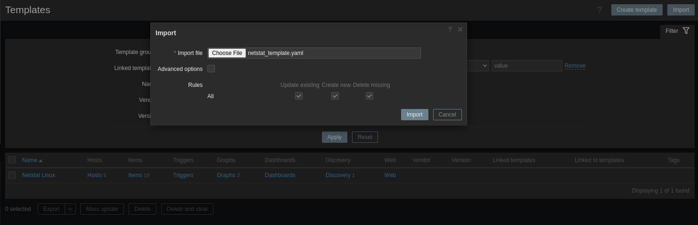
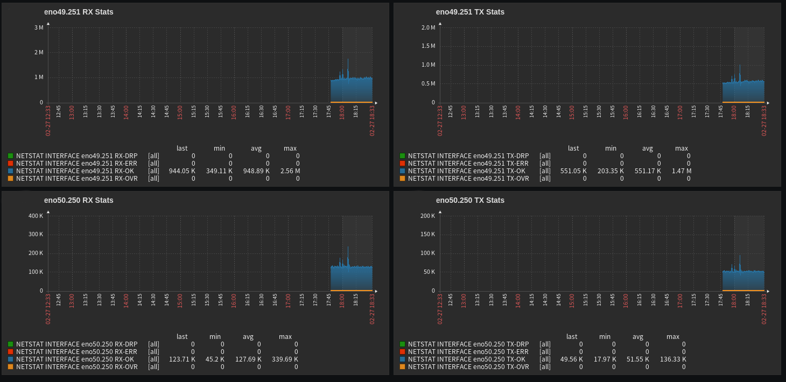
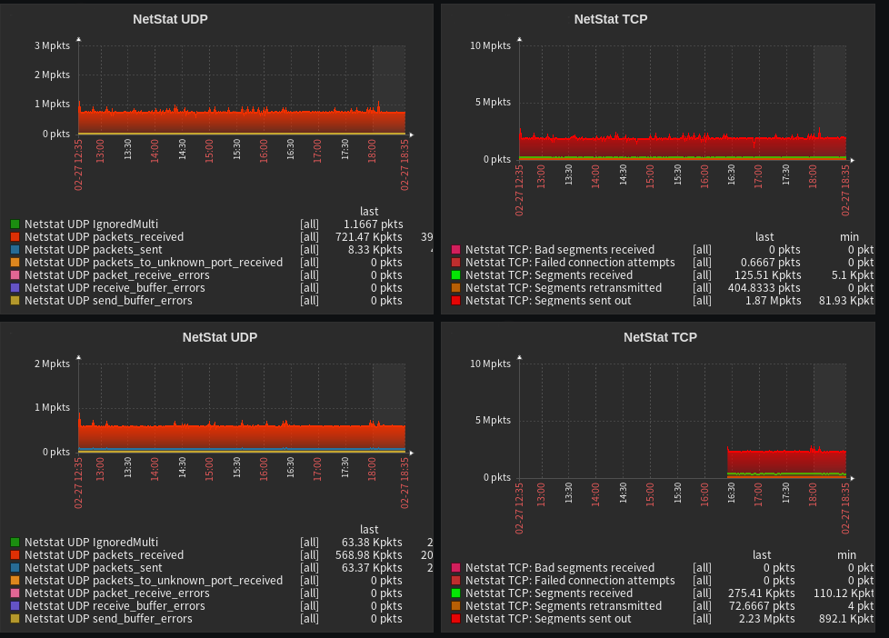

# netstat-mon
The program will help in monitoring TCP\UDP statistics. Based on netstat utility

# Getting started
Copy files in to /opt folder

```
cd /opt
git clone https://github.com/x3ds-prog/netstat-mon
```

Check is file executable and make test run

```
cd netstat-mon
./main.py
```


If all ok, configure new UserParameter for zabbix agent

```
UserParameter=netstat.anus,python3 /opt/netstat-mon/main.py
```

Import zabbix template "zbx_netstat_template.yaml"



Have fun

*Monitoring by interface stats*



*Total TCP\UDP Stats*


